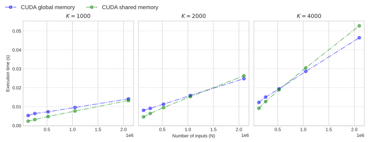

# Multi-layer-Neural-Network

This repository contains a multi-layer neural network implementation in C with OpenMP and CUDA. The network is a simple feedforward neural network composed of 1D locally connected layers, distinct from standard convolutional layers as each neuron possesses unique weights. Our goal is to optimize the forward propagation phase on multi-core CPUs using OpenMP and GPUs using CUDA by exploiting the inherent parallelism within each layer's computation. We evaluate performance by varying input size ($N$) and layer depth ($K$), measuring execution time, scalability, and throughput.


While layers execute sequentially ($k \to k+1$), computing the output $\mathbf{y}^{(k+1)} \in \mathbb{R}^{M}$ (where $M=N-R+1$) from input $\mathbf{x}^{(k)} \in \mathbb{R}^{N}$ is parallelizable. Each output element $y^{(k+1)}_{i}$ involves an independent dot product and activation:
$$
  y^{(k+1)}_{i} = \sigma\Bigl(\sum_{r=0}^{R-1} W^{(k)}_{i,r} \; x^{(k)}_{i+r} + b^{(k)}_{i}\Bigr), \quad \text{for } i = 0, \dots, M-1.
$$
Key challenges are handling redundant reads of shared input elements and ensuring coalesced memory access on GPUs.

## Compile

### OpenMP

Compiled with the flags `-std=c99 -Wall -Wpedantic -fopenmp` and linked with the math library `-lm`.

```bash
gcc -std=c99 -Wall -Wpedantic -fopenmp multi-layer-nn.c -o multi-layer-nn -lm
```

We parallelize the outer loop ($i=0, \dots, M-1$) over CPU cores using OpenMP's `parallel for` with `static` scheduling, suitable for uniform workloads. The inner dot product loop (sum over $R$) is manually unrolled to reduce loop overhead and potentially enable compiler optimizations like SIMD vectorization, although the specific impact of SIMD was not explored in detail in this report.

### CUDA

```bash
nvcc cuda-multi-layer-nn.cu -o cuda-multi-layer-nn
```

Each output neuron $y_i^{(k+1)}$ is mapped to a CUDA thread. We use a standard grid-block hierarchy with a large block dimension ($\texttt{BLKDIM}$, e.g., 1024) to maximize occupancy. The number of blocks ensures all $M$ outputs are computed: $\text{Blocks} = \lceil M + \texttt{BLKDIM} - 1 / \texttt{BLKDIM} \rceil$. 

Two memory strategies were compared:

- $\textbf{Global Memory Access:}$ Threads directly read required inputs $\mathbf{x}^{(k)}$ and weights $W^{(k)}$ from global memory. Performance relies on coalesced access patterns.

- $\textbf{Shared Memory Caching:}$ Threads within a block collaboratively load a tile of $\mathbf{x}^{(k)}$ (including halo regions for the receptive field $R$) into fast on-chip shared memory. This reduces global memory traffic by reusing shared input elements but still requires global reads for unique weights $W^{(k)}_{i,\cdot}$.

GPU buffers (input $\mathbf{x}$, weights $W$, output $\mathbf{y}$) are managed within a single $\texttt{NeuralNet}$ struct, allocated contiguously to minimize fragmentation using a centered‐stencil indexing ($\mathrm{RADIUS}=(R-1)/2$). Layer dimensions are computed dynamically. After each layer's computation, input and output pointers ($\mathbf{x}, \mathbf{y}$) within the struct are swapped, avoiding redundant memory copies. Host-side timers ($\texttt{hpc\_gettime}$) measure end-to-end execution time, averaged over multiple trials. Throughput is calculated as total output elements computed across all layers per second.

## Run

### OpenMP with custom parameters

Default parameters are $N = 1024$, $K = 2$. $R$ is fixed and set to the value of $3$, hence each output neuron is connected to 3 input neurons.

```bash
OMP_NUM_THREADS=<NUMBER OF THREADS> ./multi-layer-nn [N] [K]
```

### CUDA with custom parameters

```bash
./cuda-multi-layer-nn [N] [K]
```

## Scalability

Experiments were conducted on the Giano HPC cluster (8-core/16-thread CPU, NVIDIA L40 GPU). $R=3$ is used unless stated otherwise. We denote input length by $N$, number of layers by $K$, receptive field width by $R$, and CPU threads by $P$.

### Strong Scaling

We fix the problem size at $N=2^{20}$, $K=1000$, $R=3$ and vary $P$ from 1 to 16.

The `strong-scaling.sh` script runs the program with a fixed-size problem and a varying number of threads in OpenMP.

For further analysis, the output was redirected to a csv file and plotted using pandas and matplotlib python libraries.

```bash
bash strong-scaling.sh > csv/strong-scaling.csv
```

<div style="display: flex; justify-content: center; gap: 10px;">
    <div>
        
    </div>
    <div>
        
    </div>
</div>

### Weak Scaling

For weak scaling, each thread handles a fixed subproblem of size $N/P=2^{20}/P$ over $K=1000$ layers. 

The `weak-scaling.sh` script runs the program with a varying size problem that scales with the number of threads in OpenMP,

The same output redirection and plotting process was used for the weak scaling analysis.

```bash
bash weak-scaling.sh > csv/weak-scaling.csv
```

<div style="display: flex; justify-content: center; gap: 10px;">
    
</div>

### CUDA Performance

We compare CUDA global and shared memory approaches against the 8-core OpenMP baseline.

The `cuda-perf.sh` script runs the program with a varying size problem and checks the performance of the program with and without shared memory. It computes the throughput of the program with and without shared memory as well as the execution time of the program.

```bash
bash cuda-perf.sh > csv/cuda-perf.csv
```

The following figure shows execution time scaling linearly with input size $N$ and layer count $K$. Shared memory consistently outperforms global memory due to efficient data reuse via on-chip memory, with the benefit increasing for larger $N$.

<div style="display: flex; justify-content: center; gap: 10px;">
    
</div>

---

Correspondingly, the following figure shows throughput increasing with $N$, indicating better GPU utilization. Shared memory achieves significantly higher throughput by reducing global memory latency and bandwidth usage. Throughput is relatively stable across different $K$ for a fixed $N$.

<div style="display: flex; justify-content: center; gap: 10px;">
    
</div>

---

The following figure presents the speedup of CUDA implementations relative to the 8-core OpenMP baseline. Speedup generally increases with $N$, showcasing the GPU's advantage for larger problems. Shared memory (green bars) consistently provides higher speedup than global memory (blue bars). For the largest input size ($N=2^{21} \approx 2.1 \times 10^6$), shared memory achieves impressive speedups up to $354\times$ (for $K=4000$). Increasing the number of layers $K$ also tends to improve speedup by amortizing kernel launch overheads, although the gains may lessen for very deep networks (compare $K=2000$ vs $K=4000$ panels). At $N=2^{20}$ (approx $1.05 \times 10^6$), the speedups are $295\times$ ($K=1000$), $342\times$ ($K=2000$), and $333\times$ ($K=4000$) for shared memory.
<div style="display: flex; justify-content: center; gap: 10px;">
    
</div>

## Appendix: Sliding-Window Reformulation

Given an input vector $\mathbf{x} = [x_0, x_1, \ldots, x_{N-1}]$ of dimension $N$ and a receptive field size $R$, the output vector $\mathbf{y}$ has a dimension $M = N - R + 1$. For an example case where $N=5$ and $R=3$, the output dimension is $M = 3$. The first two output elements ($y_0, y_1$) are computed individually as:
$$
  y_0 = \sigma\bigl(x_0 W_{0,0} + x_1 W_{0,1} + x_2 W_{0,2} + b_0\bigr), \\
  y_1 = \sigma\bigl(x_1 W_{1,0} + x_2 W_{1,1} + x_3 W_{1,2} + b_1\bigr).
$$
Here, $W_{i,j}$ represents the weight connecting the $j$-th input in the window for output $i$ to the $i$-th output neuron, and $b_i$ is the bias for the $i$-th output neuron. Weights are generally *not* shared between different output neurons in this locally connected formulation.

To potentially improve data locality and leverage matrix operations, one can construct an intermediate matrix $X$ by applying a sliding window to the input vector $\mathbf{x}$ (often called `im2col` or `unfold`):
$$
  X =
  \begin{bmatrix}
    x_0 & x_1 & \cdots & x_{R-1} \\
    x_1 & x_2 & \cdots & x_{R}   \\
    \vdots & \vdots & \ddots & \vdots \\
    x_{M-1} & x_{M} & \cdots & x_{N-1}
  \end{bmatrix}
  \in \mathbb{R}^{M\times R}.
$$
Let $W \in \mathbb{R}^{M \times R}$ be the weight matrix where row $i$ contains the weights for output $y_i$, and let $\mathbf{b} \in \mathbb{R}^{M}$ be the bias vector. The entire output vector $\mathbf{y} \in \mathbb{R}^{M}$ can then be expressed as:
$$
  \mathbf{y} = \sigma\bigl(\text{diag}(X W^\top) + \mathbf{b}\bigr).
$$
In this equation, $\text{diag}(\cdot)$ extracts the main diagonal of the $M \times M$ matrix product $X W^\top$, yielding the required weighted sums.

Although this sliding-window (`im2col`) approach enables potentially fully coalesced memory reads and leverages highly optimized Basic Linear Algebra Subprograms (BLAS) for the internal matrix–matrix product ($X W^\top$), it introduces complexity and overhead. Firstly, explicit transformation of the input activations of each layer into the matrix $X$ can be costly, potentially compensating for the gains in BLAS performance, especially for small $R$ or deep networks requiring repeated transformations. Secondly, it's crucial to note that even after performing the computation via $X W^\top$, the desired result is the vector $\mathbf{y}$ obtained from the *diagonal* (plus bias and activation). This output vector $\mathbf{y}$ is analogous in structure to the original input vector $\mathbf{x}$; it is **not** automatically in a matrix format (like $X$) suitable for direct use as an operand in a subsequent layer's computation if that layer also relies on a GEMM-based strategy (e.g., another `im2col` followed by matrix multiplication). Such a subsequent layer would require its *own* `im2col` transformation applied to $\mathbf{y}$. Consequently, considering the transformation overhead and the fact that the output requires further processing for subsequent GEMM-based layers, the direct, per-neuron formulation might be preferred for clarity, simplicity, and potentially better end-to-end performance in certain scenarios.