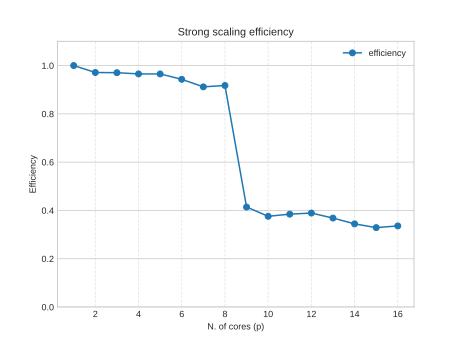
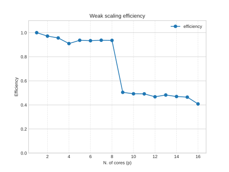

# Multi-layer-Neural-Network

A Parallel implementation for a particular kind of multi-layer Neural Network. Each output neuron is connected to (small) subset of the input neurons. The network is composed of K layers. The network is shown in the following image:


The general formulation of the network is the following:

$$
\begin{equation}
y_i = \sigma\biggl( \sum_{r=0}^{R-1} W_{i, r} \cdot x_{i+r}  + b\biggr)
\end{equation}
$$

where $W_{i, r}$ is the weight of the connection between the $i$-th output neuron and the $r$-th input neuron, $x_{i+r}$ is the $r$-th input neuron, $b$ is the bias, and $\sigma$ is the activation function (sigmoid in this case).

The network computes only the forward pass without backpropagation.

## Compile

### OpenMP

Compiled with the flags `-std=c99 -Wall -Wpedantic -fopenmp` and linked with the math library `-lm`.

```bash
gcc -std=c99 -Wall -Wpedantic -fopenmp multi-layer-nn.c -o multi-layer-nn -lm
```

### CUDA

```bash
nvcc cuda-multi-layer-nn.cu -o cuda-multi-layer-nn
```

## Run

### OpenMP with custom parameters

Default parameters are $N = 1024$, $K = 2$. $R$ is fixed and set to the value of $3$, hence each output neuron is connected to 3 input neurons.

```bash
OMP_NUM_THREADS=<NUMBER OF THREADS> ./multi-layer-nn [N] [K]
```

### CUDA with custom parameters

```bash
./cuda-multi-layer-nn [N] [K]
```

## Scalability

### Strong Scaling

Strong scaling is the ability of a parallel system to solve a fixed-size problem in less time as more processors are added to the system.

The `strong-scaling.sh` script runs the program with a fixed-size problem and a varying number of threads in OpenMP.

For further analysis, the output was redirected to a csv file and plotted using pandas and matplotlib python libraries.

```bash
bash strong-scaling.sh > csv/strong-scaling.csv
```

<div style="display: flex; justify-content: center; gap: 10px;">
    <div>
        
    </div>
    <div>
        
    </div>
</div>

### Weak Scaling

Weak scaling is the ability of a parallel system to solve larger problems in the same amount of time as the number of processors increases.

The `weak-scaling.sh` script runs the program with a varying size problem that scales with the number of threads in OpenMP,

The same output redirection and plotting process was used for the weak scaling analysis.

```bash
bash weak-scaling.sh > csv/weak-scaling.csv
```

<div style="display: flex; justify-content: center; gap: 10px;">
    
</div>

### CUDA Performance

The `cuda-perf.sh` script runs the program with a varying size problem and checks the performance of the program with and without shared memory. It computes the throughput of the program with and without shared memory as well as the execution time of the program.

```bash
bash cuda-perf.sh > csv/cuda-perf.csv
```

The following image shows the wall clock time of the CUDA program vs the wall clock time of the OpenMP program.

<div style="display: flex; justify-content: center; gap: 10px;">
    
</div>

The following image shows the throughput of the CUDA program vs the throughput of the OpenMP program.

<div style="display: flex; justify-content: center; gap: 10px;">
    
</div>

The following image shows the speedup of the CUDA program vs the speedup of the OpenMP program.

<div style="display: flex; justify-content: center; gap: 10px;">
    
</div>

The following image shows the efficiency of the CUDA program vs the efficiency of the OpenMP program.

<div style="display: flex; justify-content: center; gap: 10px;">
    
</div>
